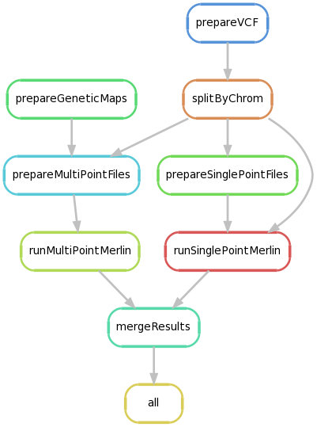

LODSEQ
######

LodSeq performs the genetic linkage analysis across families, by computing lod-scores given a gvcf file and a related tfam pedigree file.

Both singlepoint and multipoint parametric linkage analyses are computed using `merlin <http://csg.sph.umich.edu/abecasis/merlin/>`_ (*Abecasis et al. Nature Genetics 2002*).

|

PREREQUISITES
=============

- `Python <https://www.python.org/>`_ >= 3.5
- `Conda <https://conda.io/>`_ >= 4.3
- `Snakemake <https://snakemake.readthedocs.io/en/stable/>`_ >= 3.9.0

|

INSTALLATION
============

Download genetic maps from the HapMap project:

.. code-block:: bash

     $ cd data/inputs/
     $ wget -nc ftp://ftp.ncbi.nlm.nih.gov/hapmap/recombination/2011-01_phaseII_B37/genetic_map_HapMapII_GRCh37.tar.gz
     $ mkdir genetic_map_HapMapII_GRCh37 \
       && tar -zxf genetic_map_HapMapII_GRCh37.tar.gz -C genetic_map_HapMapII_GRCh37
     $ cd ../..

|

Once the prerequisites have been installed, configure the environment.
vcftools, plink and merlin will be installed by conda:

.. code-block:: bash

     $ conda env create -n lodseq --file environment.yaml

|

Then, check that the external programs have been properly installed:

.. code-block:: bash

     $ source activate lodseq
     $ which vcftools && vcftools
     $ which plink && plink
     $ which merlin && merlin
     $ source deactivate lodseq

|

QUICK START
===========

The quick start dataset was arbitrarily modified from this available dataset:

https://github.com/jmchilton/SnpEffect/tree/master/papers/Protocol/data/chr7.vcf.gz

- The pedigree was reduced to 6 individus.
- Some genotypes were modified replacing phased genotypes by unphased genotypes.
- Some records were removed to reduce the final file size.

|

Activate the environment

.. code-block:: bash

     $ source activate lodseq

|

Run the workflow (using 2 threads)

.. code-block:: bash

     $ mkdir test/
     $ snakemake -s Snakefile --configfile config.yaml -j 2

|

Exit

.. code-block:: bash

     $ source deactivate lodseq

|

RESULTS
-------
The lod-score results are output into directory ``test/``.

You can choose a different output directory by changing the value of the field ``out_dir`` into ``config.yaml``.

Please compare your results to the expected output files:

.. code-block:: bash

     $ cd data/outputs/mergeResults/
     $ ls -1
         results_multipoint_merged_dominant.txt
         results_multipoint_merged_recessive.txt
         results_singlepoint_merged_dominant.txt
         results_singlepoint_merged_recessive.txt

|

**RESULT EXAMPLE**

Parametric singlepoint analysis using a recessive model:

.. code-block:: bash

     $ less test/runSinglePointMerlin/7/results_singlepoint_chr7_recessive.txt
     Parametric Analysis, Model Recessive_Model
     =======================================================
       POSITION        LOD      ALPHA       HLOD
        7:16487      0.000      0.000      0.000
        7:16671      0.000      0.000      0.000
        7:16692      0.000      0.000      0.000
        7:16712      0.000      0.000      0.000
        7:16717      0.000      0.000      0.000
        7:16719      0.000      0.000      0.000
        7:16787      0.000      0.000      0.000
        7:16798      0.000      0.000      0.000
        7:16878      0.000      0.000      0.000
        7:17881      0.000      0.000      0.000
        7:18510      0.000      0.000      0.000
        7:19181     -2.575      0.000      0.000

See documentation of `merlin <http://csg.sph.umich.edu/abecasis/merlin/tour/parametric.html>`_ for a complete description.

|

**WARNINGS**

Loci with bad inheritance or loci with multichar allele variation will have a null lod-score (-0.000 or 0.000).

|

RUN LODSEQ ON A NEW DATASET
===========================
Edit the file ``config.yaml`` to change parameters of the workflow.

Description of the fields into ``config.yaml``:

.. code-block:: bash

     vcf            # input gvcf file (.vcf or .vcf.gz)
     tfam           # input pedigree tfam file
     dom_model      # dominant model file
     rec_model      # recessive model file
     genetic_maps   # path of the HapMap genetic maps directory
     out_dir        # path of the directory containing LodSeq output files
     out_log        # path of a log file
     out_prefix     # prefix of output files
     lod_threshold  # minimal significant lod-score value, must be greater than 0
     threads        # number of threads used by multithread steps
     chromosomes    # list of chromosomes to analyze

|

You can also change the parameters of the recessive and dominant models:

.. code-block:: bash

     $ less data/inputs/parametric_dominant.model
     $ less data/inputs/parametric_recessive.model

The parameters of these models are respectively:

- affection name
- disease allele frequency
- penetrances
- model name

See a complete description and examples on `merlin website <http://csg.sph.umich.edu/abecasis/merlin/tour/parametric.html>`_
and `here <http://csg.sph.umich.edu/abecasis/merlin/reference/parametric.html>`_.

|

LODSEQ PIPELINE
===============

|

AUTHORS
=======
Edith Le Floch, Centre National de Recherche en Génomique Humaine - CEA, Evry, France, edith.le-floch@cea.fr

Elise Larsonneur, Centre National de Recherche en Génomique Humaine - CEA, Evry, France, elise.larsonneur@cea.fr

|

CONTACT
=======
For help please contact the authors.

|

LICENSING
=========
LodSeq is released under the terms of the CeCILL license,
a free software license agreement adapted to both international and French legal matters
that is fully compatible with the GNU GPL, GNU Affero GPL and/or EUPL license.

For further details see LICENSE file or check out http://www.cecill.info/.

.. image:: https://img.shields.io/badge/license-CeCILL-blue.svg
    :target: http://www.cecill.info/

